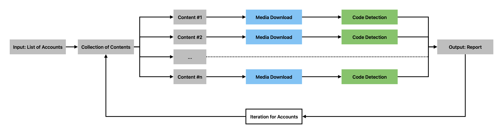
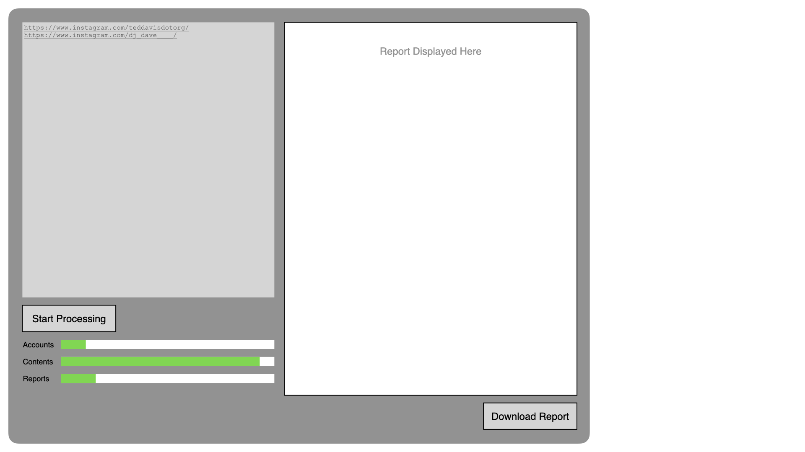
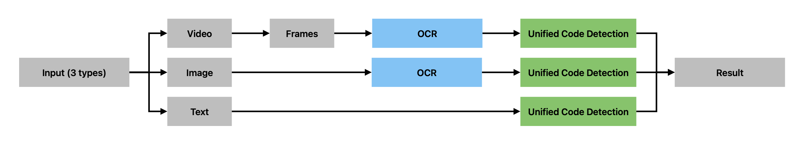

# ig-code-detector

## Task

We aim to design a pipeline that automatically query instagram accounts and their contents and detect if codes are included. The major stages of the program are:
1. Input: The account, or list of accounts, to query
2. Media download (iterative)
3. Code detection (iterative)
4. Output: Report

Some additional requirements we have are:
* The UI should be intuitive and allows for efficient processing
* The process should incorporate parallel computing to be efficient
* The program should be interpretable so users can see stages of the pipeline
* The resulting report should be structural and understandable

## High-Level Architecture

To summarize, the elements we have in the pipeline are:
* Module to download all contents under an account
* Module to detect codes in one piece of content
* Temporary database to store downloaded contents
* Database to hold output reports

## Input and UI

Users can input a list of links to the account they wish to be examined. Once they started the program, they will be able to track the process of the program, including how many accounts and contents have been detected as well as the status of generated reports.

To record the progress of each stages, we first create a database that serves as our 'state management' system for the pipeline. It has the structure below:
```json
{
  "pipeline_metadata": {
    "created_at": "2025-09-30T10:30:00Z",
    "last_updated": "2025-09-30T11:45:00Z",
    "version": "1.0",
    "total_accounts": 1,
    "total_contents": 0,
    "pipeline_status": "in_progress"
  },
  "accounts": [
    {
      "account_id": "teddavisdotorg",
      "account_url": "https://www.instagram.com/teddavisdotorg/",
      "status": "pending",
      "added_at": "2025-09-30T10:30:00Z",
      "last_processed": null,
      "metadata": {
        "total_posts": null,
        "posts_downloaded": 0,
        "posts_analyzed": 0,
        "posts_with_code": 0
      },
      "contents": [],
      "report": {
        "status": "not_started",
        "generated_at": null,
        "report_path": null
      },
      "errors": []
    }
  ]
}
```

Notice that we not yet have the content-specific statuses until we start discovering contents using our module. The data structure for contents looks like:
```json
{
  "contents": [
    {
      "content_id": "C12345ABC",
      "content_type": "video",
      "content_url": "https://www.instagram.com/p/C12345ABC/",
      "posted_at": "2025-09-15T14:22:00Z",
      "download": {
        "status": "completed",
        "started_at": "2025-09-30T10:35:00Z",
        "completed_at": "2025-09-30T10:35:30Z",
        "local_path": "./data/raw/teddavisdotorg/C12345ABC.mp4",
        "file_size_mb": 12.5,
        "error": null
      },
      "analysis": {
        "status": "completed",
        "started_at": "2025-09-30T10:36:00Z",
        "completed_at": "2025-09-30T10:37:15Z",
        "contains_code": true,
        "confidence": 0.87,
        "code_frame_ratio": 0.65,
        "frames_analyzed": 45,
        "code_frames_detected": 29,
        "detected_languages": ["processing", "javascript"],
        "error": null
      }
    }
  ]
}
```

## Download Module

We are using github repo [instaloader](https://github.com/instaloader/instaloader?tab=readme-ov-file) to download all posts (including medias and captions) under an account.

To install the module, run:
```
pip3 install instaloader
```
To test the download functionality, we use the demo script:
```
python download_demo.py <instagram_username>
```

One **blocker** we have, which causes the program to fail, is Instagram's anti-crawling mechanism. I would need more time to figure out how to download posts legally and effectively.
```
JSON Query to graphql/query: 403 Forbidden
JSON Query to graphql/query: 401 Unauthorized
```

## Detector Module

We are dealing with three media types: image, video, and caption. However, if we look closer, all code deetection reduces to text analysis. Since code is fundamentally text, we convert all media types to text, then apply a single unified detection algorithm.


As you can see, we need three modules for this pipeline:
1. Text extraction from images
2. Frame extraction from videos
3. Unified code detection from texts

### Text extraction from images (using OCR)

We will use local OCR [tesseract](https://github.com/tesseract-ocr/tesseract) to extract texts from images.

To install the module, run:
```
brew install tesseract
pip3 install pytesseract Pillow
```

**Experiment**: when we input the following image content from [nanditi.k](https://www.instagram.com/nanditi.k/) into the module, we get the text extracted below. Notice that the result is not precise but good enough for code detection.

```
Extracting text from: /Users/shiwenzhu/Desktop/image-example.png
============================================================
CRAFTY
=) MELODIES

See WITH ALGORITHMS & fie
PUZZLE CANONS

Live_loop :taanbot | |
with_fx :ixi_tee{fiii= TTT ae
use_random_ See il |
use_synth :plt
= [0.125, 0.
16.times do
| r = (0.125, 0.25, 0.5].choose
n = (ring :c3, :d3, :e3, :fs3,
| | :fs4, :c5, :d4, :e4, :94,
co = rrand(30, 100)
sus = rrand(0, 0.25)
play n, release: r, cutoff: co
| sleep s
| end
end
end RY)
```

### Text extraction from images (using LLM)

While OCR tools are fast and work offline, they can struggle with more complex backgrounds or overlapping text, unusual fonts, mixed content, and etc. To improve extraction accuracy, we can use multimodal LLMs (such as Claude and Gemini). **We will use API calls.** However, we then face the trade-off of having higher cost ($0.01 per image) and slower speed (3 seconds per image).

### Frame extraction from videos

We use [OpenCY](https://pypi.org/project/opencv-python/) which is in python standard library for our video to images processing.

To install the module, run:
```
pip3 install opencv-python
```

**Experiment**: when we input the linked [video](./report-materials/video-example.mov) into the module, we get the extracted [frame1](./extracted_frames/video-example_frame_0000_t0.00s.jpg) and [frame2](./extracted_frames/video-example_frame_0001_t11.97s.jpg) stored as .jpg files in our directory.
```
Video Properties:
  - FPS: 29.98
  - Total Frames: 642
  - Duration: 21.41 seconds (0.36 minutes)
  - Extracting 5 frames per minute

Extracting 1 frame every 359 frames (12.0 seconds)

Extracting frames...

✓ Extraction complete!
  - Total frames extracted: 2
  - Frames saved to: ./extracted_frames
```

### Unified code detection from texts